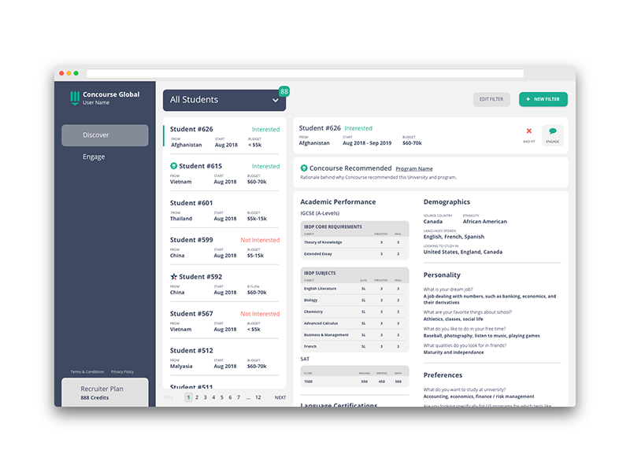
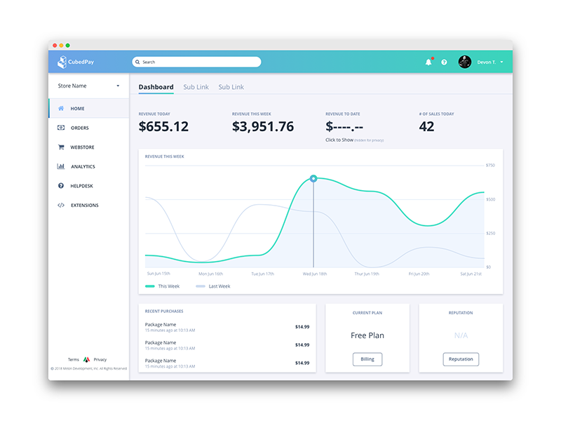
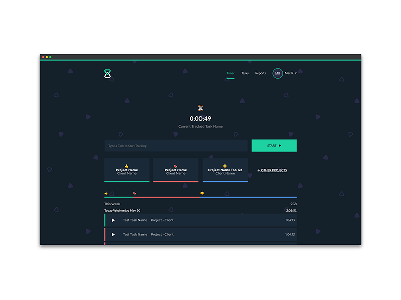

<section>
      <h3>Selected Work</h3>
      
More examples of work available upon request

</section>
<section>
      
      <h4>Concourse Global</h4>
      
UI Design, UX Research, Product Management

      
Concourse helps high school counselors find best-fit university programs for their students while connecting students directly with interested universities.

      <a href="mailto:m@credd.in">Ask For More Info</a>
</section>
<section>
      

       
      
      <h4>Cubed Pay</h4>
      
UI Design, UX Research, Branding

      
CubedPay provides game integrated storefronts allowing video game servers and developers to monetize their playerbases.

      <a href="mailto:m@credd.in">Ask For More Info</a>
</section>
<section>
      

       
      
      <h4>Hocus Timer</h4>
      
UI Design, Branding, Front-End Developerment

      
Hocus Timer is a small time tracking app designed to provide more in depth features for freelancers to spend less time tracking and more time working.

      <a href="mailto:m@credd.in">Ask For More Info</a>
</section>
<section>
      

       
      
      <h4>Student Faces</h4>
      
UI Design, UX Research

      
Student Faces helps teachers more quickly learn student's names and faces at the start of a new semester or school year.

      <a href="mailto:m@credd.in">Ask For More Info</a>
</section>
